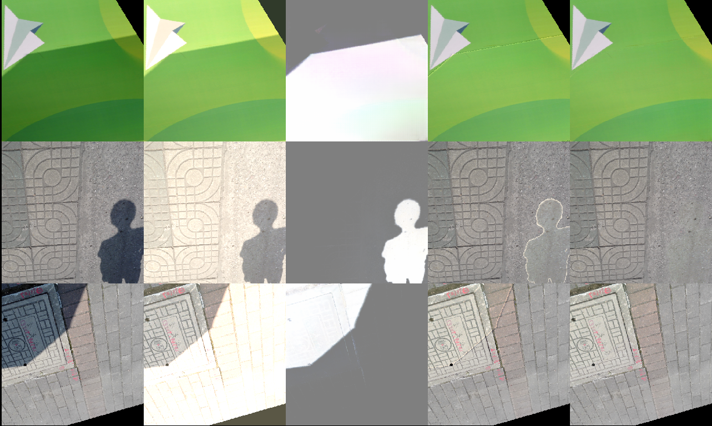

# Shadow Removal via Shadow Image Decomposition
Pytorch implementation for ICCV19 "Shadow Removal via Shadow Image Decomposition" and PAMI21 "Physics-based Shadow Image Decomposition for Shadow Removal"

[Project Page](https://www3.cs.stonybrook.edu/~cvl/projects/SID/index.html)

Paper: https://arxiv.org/abs/2012.13018

**Download links:**

[SBU-TimeLapse Dataset](http://vision.cs.stonybrook.edu/~hieule/SBUTimeLapse/SBUTimeLapse.zip)

[SBU-TimeLapse Results](http://vision.cs.stonybrook.edu/~hieule/SBUTimeLapse/SID_results.zip)

[Adjusted ISTD Dataset](https://drive.google.com/file/d/1rsCSWrotVnKFUqu9A_Nw9Uf-bJq_ryOv/view?usp=sharing)

For the A-ISTD dataset, we only adjust the shadow-free images of the ISTD dataset, the shadow images and shadow masks stay the same as of the original ISTD dataset.

**Note on the shadow removal evaluation code**: We recently figured that the RMSE evaluation code that many papers have been using (including ours) is actually calculating Mean Absolute Error. We will retrospectively fix this in all our papers and suggest everyone to do the same. 

This MAE evaluation code can be downloaded here: https://drive.google.com/file/d/1-lG8nAJbWajAC4xopx7hGPKbuwYRw4x-/view?usp=sharing 



**New**: Please check out [Weakly Supervised Shadow Removal](https://github.com/lmhieu612/FSS2SR), our new unparied patch-to-patch translation model for shadow removal.

This pytorch implementation is heavily based on the pix2pix framework written by [Jun-Yan Zhu](https://github.com/junyanz). Many thanks!

**Pretrained-model**:

----ICCV19 version with limiting the search space for shadow parameters (Our model reported in the ICCV19 paper does not include this simple technique):

https://drive.google.com/drive/folders/17G_lf1k2CNt9wt4X2hWxeT8-7bOXpWQe?usp=sharing

----PAMI21 (Accepted) version with the inpaining network:

https://drive.google.com/drive/folders/1K9EZ-9viGeZ3MlNDlzgAUcguSb5xFp_8?usp=sharing


**Testing**
1. Download the pretrained-model above and but them into ./checkpoint_path/model_name/..pth
2. Set the path to the shadow-mask of the test set
3. 

For the ICCV19 version: 

```python infer.py --model SIDPAMIw --name model_name --epoch best```

For the PAMI version:

```python infer.py --model SIDPAMIwinp --name model_name --epoch best```


**Training**

To generate "train_params": please run the ipython notebook included in "data_processing".

Please refer to the training script in the "scripts" folder. 


**Shadow removal results:**

SBU: https://drive.google.com/file/d/1I0_m68_dKwK4gD6WSRgChtXaNrvsU56l/view?usp=sharing

ISTD: https://drive.google.com/file/d/1m6FLiswQYiAiheJrJhofBQkyvQte8mt_/view?usp=sharing


If you are using this code for research, please cite:

```
Physics-based Shadow Image Decomposition for Shadow Removal - PAMI 2021 (Accepted)
Hieu Le and Dimitris Samaras

@misc{le2020physicsbased,
      title={Physics-based Shadow Image Decomposition for Shadow Removal}, 
      author={Hieu Le and Dimitris Samaras},
      year={2020},
      eprint={2012.13018},
      archivePrefix={arXiv},
      primaryClass={cs.CV}
}


Shadow Removal via Shadow Image Decomposition 
Hieu Le and Dimitris Samaras

@InProceedings{Le_2019_ICCV,
	author = {Le, Hieu and Samaras, Dimitris},
	title = {Shadow Removal via Shadow Image Decomposition},
	booktitle = {The IEEE International Conference on Computer Vision (ICCV)},
	month = {October},
	year = {2019}
}
```

And also take a look at our other shadow papers:
```
A+D-Net: Shadow Detection with Adversarial Shadow Attenuation
Hieu Le, Tomas F. Yago Vicente, Vu Nguyen, Minh Hoai, Dimitris Samaras

@inproceedings{m_Le-etal-ECCV18,
Author = {Hieu Le and Tomas F. Yago Vicente and Vu Nguyen and Minh Hoai and Dimitris Samaras},
Booktitle = {Proceedings of European Conference on Computer Vision},
Title = {{A+D Net}: Training a Shadow Detector with Adversarial Shadow Attenuation},
Year = {2018}}


From Shadow Segmentation to Shadow Removal
Hieu Le and Dimitris Samaras

@InProceedings{Le_2020_ECCV,
	author = {Le, Hieu and Samaras, Dimitris},
	title = {From Shadow Segmentation to Shadow Removal},
	booktitle = {The IEEE European Conference on Computer Vision (ECCV)},
	month = {August},
	year = {2020}
}
```
